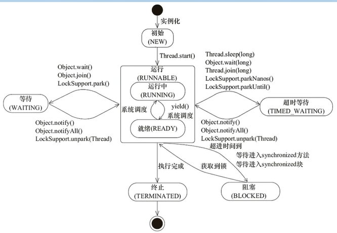

# 并发编程基础概念

## 天生的多线程
- Attach Listener: 负责监听处理JVM进程间通讯，例如jps、jstack、dump、jmap等等
- Signal Dispatcher: 负责信号分发
- Finalizer: 垃圾回收，将失去引用的对象封装到Finalizer对象，然后丢到F-Queue队列中
- Reference Handler: 引用处理

## 线程的优先级
可以通过setPorperty()设置，但是一般不会这么干，不好控制。并且线程的优先级决定的是拿到CPU时间片的时间长短，而不是先后顺序。

## 线程状态转换
- 初始状态(new创建线程时)
- 运行时
    - running(运行时，拿到了CPU时间片)
    - ready(线程刚创建完成，未分配到时间片，或者运行时的线程也可以通过yield让出时间片)
- 终止
- 等待(线程通过wait,join,pack进入一个挂起状态，然后通过notify,notifyAll,unpark重新进入运行时)
- 超时等待
- 阻塞(通过synchronized进入blocked状态)

## 线程的初始化
线程在创建初始化时会继承父类线程的属性，包括
- Daemon(是否为守护线程)
- Priority(优先级)
- 加载资源的contextClassLoader

并且分配一个唯一的tid，由sync锁保证多线程环境下id的唯一，最后在堆内等待启动。

## wait,sleep与join对比
||是否释放锁|是否支持响应中断|是否释放CPU|
|----|----|----|----|
|wait|Y|Y|Y|
|sleep|Y|Y|Y|
|join|N|Y|Y|
