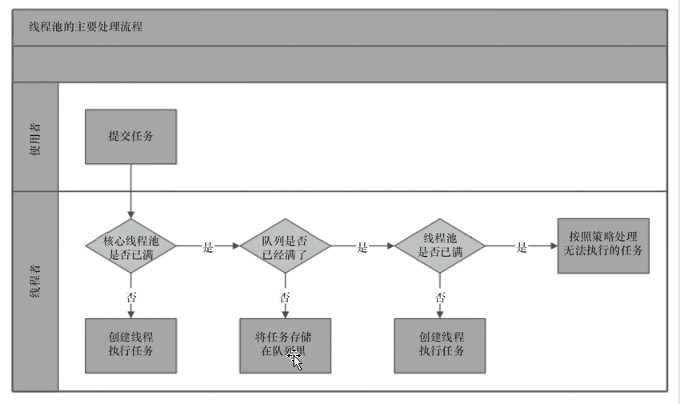
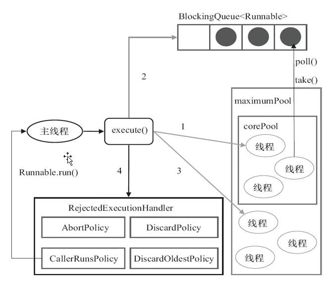
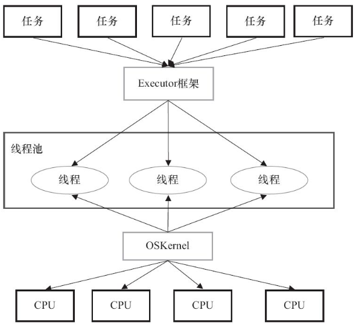
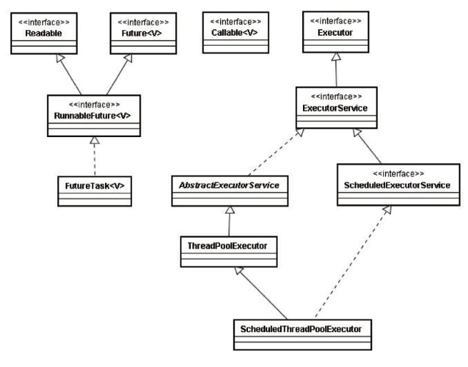
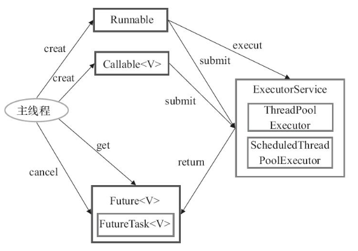
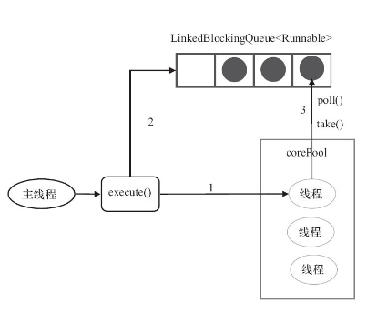

# 线程池

## 线程池概览

### 线程池工作原理
1. 提交任务
2. 判断核心线程数
3. 判断队列数量
4. 判断最大线程数
5. 拒绝策略

### 为什么要区分核心线程数和最大线程数
在核心线程数和最大线程数的中间还有一个队列。如果而核心线程数够用的话，就不需要创建额外的线程，如果核心线程数设置比较小，会导致任务都添加到Queue，这时候如果没有最大线程数，就没办法创建更多的线程来处理任务。

但是如果核心线程数创建比较大的话，可能会出现一个性能问题，因为创建核心线程数时需要获取一个全局锁。

### 线程池的全局锁
当线程数小于核心线程数时，在addWorker创建新的线程时，会有一个全局的rentreenLock来控制不允许并发创建线程，只能排队添加。

## 线程池的参数

### 核心线程数

### 任务队列
建议使用有界队列。

> 无界队列的问题

1. 最大线程数失去作用，永远无法触发
2. 可能导致内存溢出
3. 不能配置饱和策略

### 最大线程数

### 饱和策略
1. 抛出异常(相对用的比较多)
2. 调用者执行
3. 丢掉队列中最后一个任务
4. 不处理，直接丢
5. 自定义策略(推荐)

### 线程保持存活时间
如果任务多，时间段，可以设置长一些，提高线程利用率

### 时间单位
配合存活时间使用

### 线程工厂
可以通过工厂给线程设置更有意义的名字

可以使用开源框架Guaua提供的ThreadFactoryBuilder

## 如何配置线程池参数
1. 分析任务特性，CPU密集型，IO密集型。CPU密集型需要分配较小的线程数，例如NCPU+1。IO密集型，可以分配较大的线程数，可能在阻塞等待IO，这时候CPU时间片还可以分配给其他线程使用，例如2NCPU+1
2. 分析任务的依赖，例如依赖数据库连接，这时候就需要考虑数据库连接数量，不应该超过数据库连接能支持的最大并发数。
3. 分析任务的优先级，例如不同的接口优先级不同，优先保证重要接口的执行效率
4. 基于压测，评估参数是否合理
5. 配置中心，应对突发的大流量场景，需要能够动态调整线程池的核心线程数和最大线程数
6. 建议使用有界队列

## 线程池的关闭和监控

### 线程池的关闭
- shutdown(推荐，不会中断正在执行的任务，只是将线程池状态设置为shutdown)
- shutdownNow(会逐个遍历线程，设置中断标志位，尝试中断任务)

### 线程池的监控

> 可以监控的相关参数

1. taskcount 任务数量
2. completedTaskCount 完成的任务数量，<=任务数量
3. largePoolSize 曾经最大的线程数，可以判断线程池是否曾经满过
4. getPoolszie 线程数，只增不减
5. getActiveCount 活动的线程数量
6. terminated 可以在任务执行前后监控，例如执行时间，重写线程池的空方法beforeExecute等方法

## Executor框架

### 两级调度模型

用户态和内核态的转换

用户线程和系统线程一一对应

### Executor框架结构

> 三个步骤

1. 创建任务
2. 执行任务
3. 获取结果

### ThreadPoolExecutor

> 四种创建线程池的方式

1. 自定义参数，coreSize、maxSize、keepAliveTime、TimeUnit、QueueType
2. fixedThreadPoool
3. singleThreadPool
4. cacheThreadPool

其他三种本质上只是帮我们传入了自定义参数

> fixedThreadPool特点

当线程数小于coreSize，那么创建新线程执行任务

当线程数等于coreSize之后，新增的任务加入LinkedBlockingQueue(无界队列，默认最大值Integer最大值)

在fixedThreadPool中，max和饱和策略是无效参数

keepAlive参数为0，意味着多余的线程会立刻终止

使用方式

> singleThreadPool

本质上与fixedThreadPool一样，只不过线程数为1，单线程模型，其他方面与fixedThreadpool一致

> cacheThreadPool

coreSize为0，核心线程池为0

maxSize为int最大值，属于无界线程池，可以无限创建线程

keepAlive时间60秒，空闲线程保持60秒后销毁

极端情况下会创建过多线程数，导致系统崩溃

### 总结一下三个内置ThreadPool
fixed和single固定线程数，容易造成消息的积压，还无法触发饱和策略，无界队列。

cache在高并发场景可能造成cpu和内存的耗尽。

**建议自定义参数**

### 延迟任务和定期任务 ScheduledThreadPool
ScheduledPool也是ThreadPoolExecutor子类，使用的delayQueue

> 如何创建ScheduledPool

1. 直接new ScheduledThreadPoolExecutor
2. 使用Executors工具类创建ScheduledExectorsService(父类)
3. 使用Executors工具类创建，但是强转为子类ScheduledThreadPoolExecutor(推荐)

> 相关方法

schedule：只执行一次任务

scheduleAtFixedRate：从上一次开始执行任务时间点开始计算时间，周期性执行任务，如果上一次任务执行时间超过下个周期，那么下个任务将在上个任务执行完后直接执行。

scheduleWithFixedRate：从上一次任务执行结束时间开始计算时间，周期性执行任务。

### FutureTask
FutureTask实现了Future接口，代表了异步执行的结果。

> 两种使用方式

1. 提交线程池
2. 自己使用Futuretask运行

> 相关方法

get：阻塞等待异步线程执行结果

cancel：取消异步线程执行
