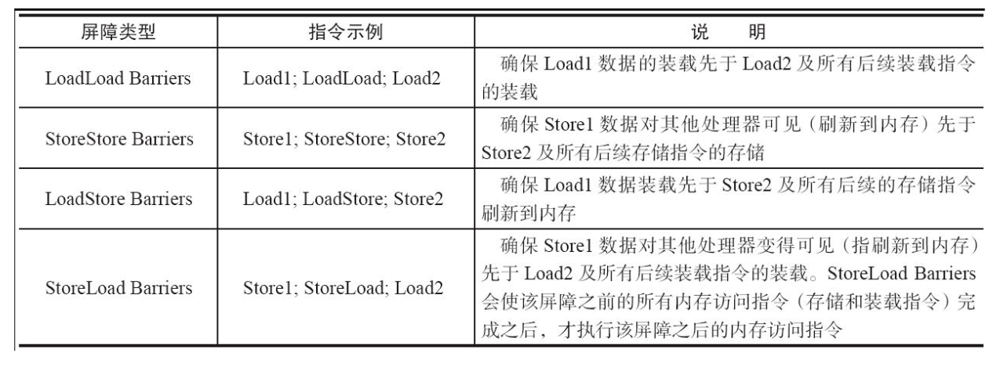

# Java内存模型

## 基本概念
### JMM内存模型

- 共享内存模型
- JMM决定了一个线程对变量的写入什么时候对另一线程可见
- 线程之间的共享变量存储在主内存中，同时每个内存也有一个私有的本地内存副本

### 指令重排序的三种情况
- 编译时的重排序
- 指令级（执行时）的重排序，可以并行执行指令，加快执行速度
- 内存系统的重排序

### 内存屏障
- 读写
- 写读
- 读读
- 写写

### as-if-serial原则
不能改变程序在单线程下的执行结果

### happen-before原则
保证多线程的同步执行结果不被改变

### 锁的内存语义
线程A释放锁，实质上是线程A向接下来要获取锁的线程发出通知消息
线程B获取锁，实质上是B接收之前释放锁的线程对共享变量的修改消息
这个是两个线程通过共享内存模型实现的**隐式通信**

