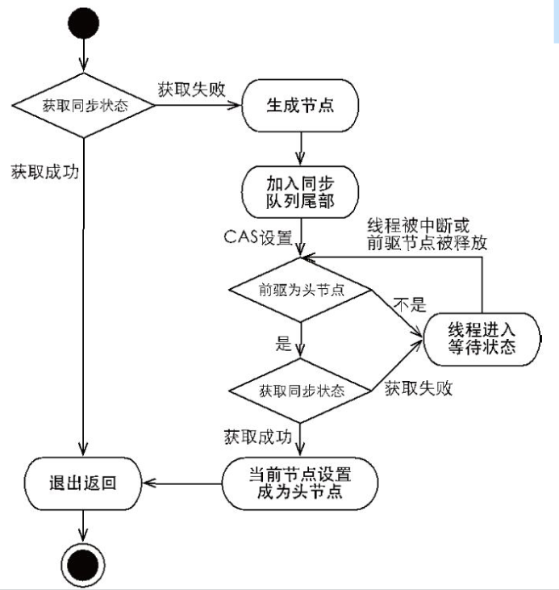
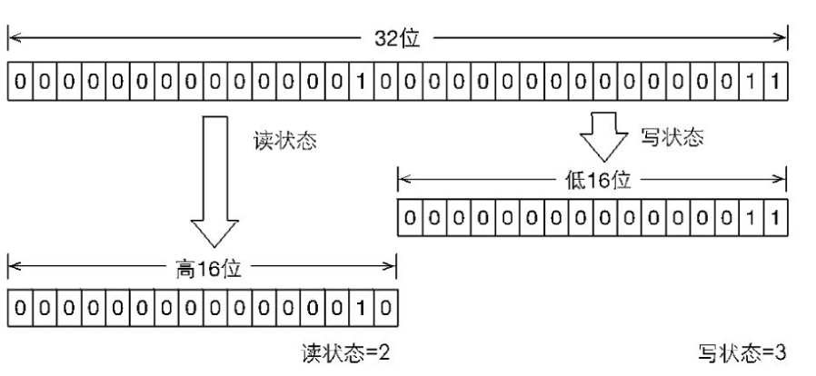
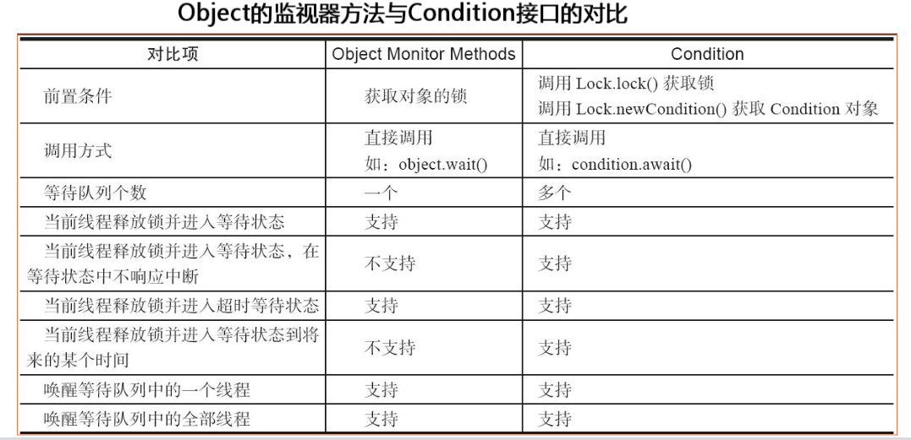
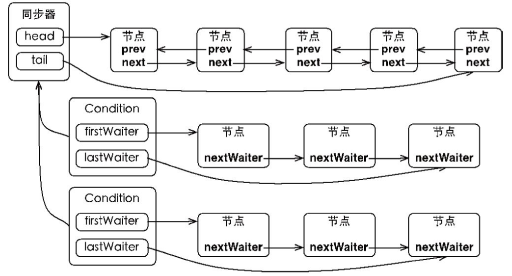

# Lock全解读

## 如何实现一个自定义lock
利用Lock接口和AQS实现一个自定义锁并测试

## Lock特性
与synchronized相比，Lock的使用更加灵活
1. 可以尝试非阻塞的获取锁，获取不到，立刻失败(tryLock，只尝试一次)
2. 获取到锁的线程支持响应中断，并释放锁
3. 能够超时等待锁，避免死锁

## AQS(同步器)

### 底层实现
一个FIFO的双端队列，同时使用一个int成员变量`state`表示同步状态。

同步器本身没有实现任何接口，利用了**模板模式**调用使用者继承同步器重写的5个方法。
1. 获取独占锁
2. 释放独占锁
3. 获取共享锁
4. 释放共享锁
5. 是否被线程持有

同时同步器提供过3个关于同步状态的方法
1. 获取状态
2. 设置状态
3. **CAS**设置状态，保证状态设置的原子性

### 同步队列AQS为什么在插入尾节点时需要使用CAS
竞争失败的线程可能是多个，插入**同步队列**时，需要保证多线程插入的安全性

## ReentrantLock
### 获取锁的流程(lock)
1. 获取同步状态
2. 获取失败进入等待队列，插入尾节点(CAS)
3. 不断自检，判断线程Node状态，signal、cancel、other

### 获取锁流程图

### 超时获取锁(tryLock)
1. 获取同步状态
2. 设置超时时间线
3. 不断获取锁，并且自检响应中断

### 公平锁与非公平锁
默认非公平锁

> 非公平指的是？

非公平指的是当新的线程来获取锁的时候，可能比队列中的线程先拿到锁。**而队列本身是FIFO，所以队列里的线程是公平的**。

非公平锁性能更高，公平锁有更多的上下文切换，挂起，park操作。

但是非公平锁容易造成线程饥饿，可能一直被插队导致队列中的线程一直拿不到锁。

> 如何实现公平锁

当新线程到来时，判断队列内是否还有等待线程，如果有就直接加入到队列。

## ReentrantReadWriteLock

### 为什么会出现读写锁
传统的synchronized锁对于两个任意操作都是互斥的，包括读读操作。

但是大多数场景都是读多写少，如果读读不互斥，那么会有更好的并发和吞吐量。

### 如果实现读锁和写锁的区分
通过一个32位的int变量state，高16位和低16位划分分别表示读状态和写状态。

### 写锁加锁步骤
1. 判断是否有读锁或者写锁，有则失败
2. 可重入，如果当前锁持有线程是自己，判断可重入次数，超出则失败
3. CAS抢锁，抢到就设置自己为执行线程

### 读锁加锁过程
1. 当前存在写线程，并且线程不是自己，失败
2. 当前存在读线程或者写线程，并且线程是自己，获取锁成功，并维护**读锁计数在自身的ThreadLocal**。
3. 如果存在多个线程都持有读锁，维护各自的读锁数量
4. 没有CAS设置没有成功，死循环获取

### 锁降级
写锁降为读锁，而不是重量级锁、轻量级锁、偏向锁。

## LockSupport
用于实现阻塞当前线程。直接使用的native方法。

## Condition
任何一个Java对象都拥有一组监视器方法，wait、notify

通过这些方法与synchronized同步关键字配合可以实现等待/通知模式（生产消费模型）

Condition接口也提供了类似Object的监视器方法

### Object和Condition接口对比

### Condition实现生产消费
- 生产消费各自独立等待队列
- signal唤醒对应生产或者消费线程

### Condition的原理
一个同步队列，多个等待队列。当线程在等待队列被唤醒，就去竞争锁，拿到了锁就继续执行await之后的代码。没竞争到锁，就加入同步队列。如果在同步队列又竞争失败了，就又回到等待队列。

### await源码
1. 判断线程中断标志，抛出中断异常
2. 添加到等待队列
3. 释放当前线程

### signal源码
1. 唤醒等待队列的第一个节点
