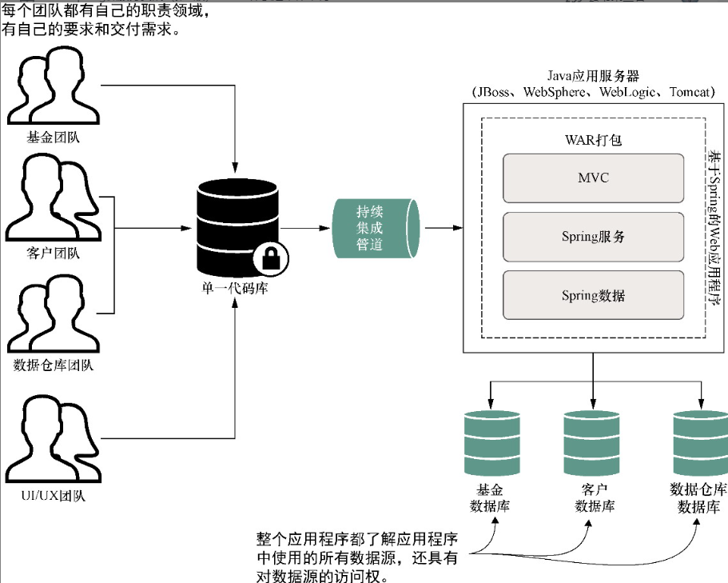
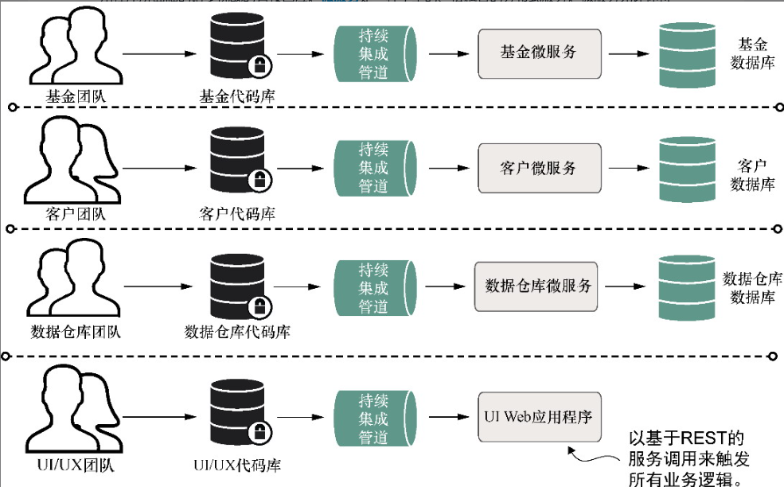
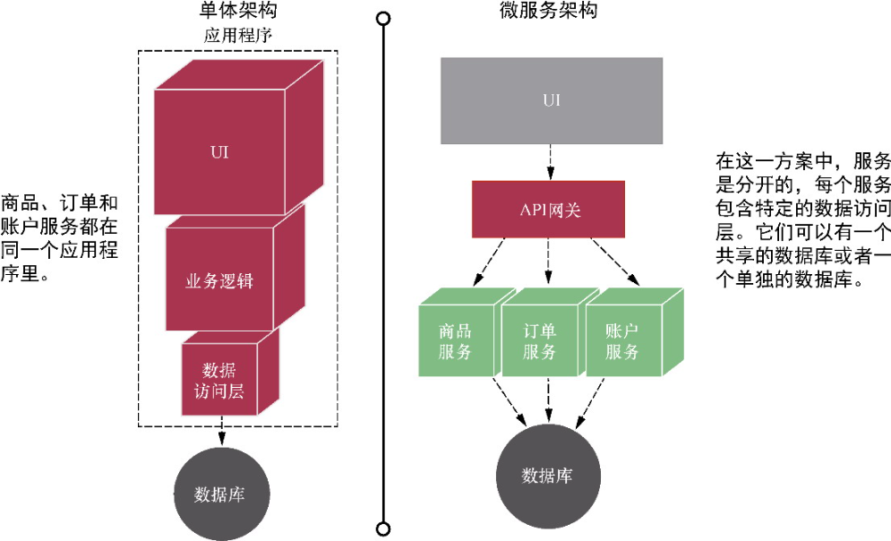
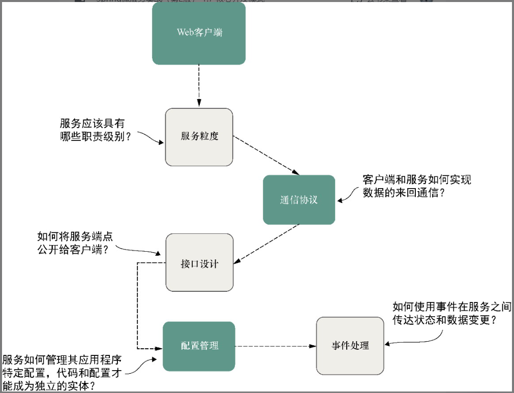

# 微服务概述

## 微服务概述

### 对比微服务与单体服务
**虽然许多公司将自身产品从单体架构调整至微服务架构，然后，“单体架构“并非贬义词，”微服务架构“也不是银弹。**

### 微服务优点
- 灵活性，快速交付，一个较小的代码单元，更改越不复杂，测试部署的时间越短
- 弹性，当部分服务出现不可恢复的问题时，可以优雅降级，控制错误影响范围
- 可伸缩性，小型服务的扩展是局部的，成本效益更高

### 依赖注入框架
允许你通过注解的方式将应用程序之间的对象关系外部化，而不是在对象内部彼此硬编码实例代码

### 运行springboot项目
mvn spring-boot:run

### anything as a service
todopic

### 微服务开发需要考虑的基本主题
1. 服务粒度
2. 通信协议
3. 接口设计
4. 服务配置管理
5. 服务之间的事件处理

### 路由模式
- 服务发现（内部服务的互相发现）
- 服务路由（为外部客户端访问提供一个统一的入口）

### 客户端弹性模式
- 客户端负载均衡缓存
- 断路器
- 后备模式
- 舱壁模式

### 安全模式
- 验证
- 授权
- 凭证管理和传播

### 日志记录与跟踪模式
- 日志关联
- 日志聚合
- 微服务跟踪

### 应用程序度量模式
- 抓取服务的关键数据
- 抓取后如何存储
- 如何可视化展示

